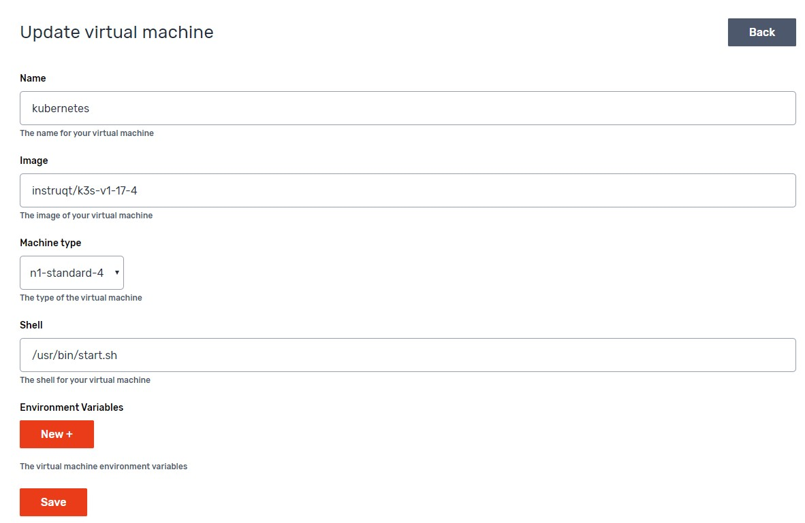

# Instruqt packer image for K3s
This repo contains the source files to build a K3s image for Instruqt.

What's includes:
- K3s
- Helm
- Kubernetes dashboard
  - To update to the latest dashboard:
    ```
    GITHUB_URL=https://github.com/kubernetes/dashboard/releases
    VERSION_KUBE_DASHBOARD=$(curl -w '%{url_effective}' -I -L -s -S "${GITHUB_URL}/latest" -o /dev/null | sed -e 's|.*/||')
    curl -sL -o files/dashboard.yml "https://raw.githubusercontent.com/kubernetes/dashboard/${VERSION_KUBE_DASHBOARD}/aio/deploy/recommended.yaml"
    # Enable skipping login page
    sed -i '/--namespace=kubernetes-dashboard/a \            - --enable-skip-login' files/dashboard.yml
    ```

- Systemd service for kubectl proxy
- Bash script to wait for Kubernetes dashboard to start and print the dashboard token (`/usr/bin/start.sh`)
- Kubectl completion (see section on how to enable kubectl autocompletion)

## Current active images
Images are built upon releases on the [K3s repo](https://github.com/k3s-io/k3s). This is a list of images available:

`instruqt/k3s-v1-21-1`

`instruqt/k3s-v1-20-4`

`instruqt/k3s-v1-19-8`

`instruqt/k3s-v1-18-16`

`instruqt/k3s-v1-18-8`

`instruqt/k3s-v1-18-6`

`instruqt/k3s-v1-18-4`

`instruqt/k3s-v1-18-3`

`instruqt/k3s-v1-18-2`

`instruqt/k3s-v1-17-11`

`instruqt/k3s-v1-17-9`

`instruqt/k3s-v1-17-7`

`instruqt/k3s-v1-17-6`

`instruqt/k3s-v1-17-5`

`instruqt/k3s-v1-17-4`

## Usage on Instruqt
There is no need to build this packer image yourself. It has already been built.
We advise you to use machine type `n1-standard-2` or higher to ensure stability.

### How to configure this image in your config.yml
Use the following config in your Instruqt config.yml to use this image:

```yaml
version: "2"
virtualmachines:
- name: kubernetes
  image: instruqt/k3s-v1-20-4
  shell: /usr/bin/start.sh
  machine_type: n1-standard-2
```

### How to configure this image in the web interface
Use the following config in your Instruqt track:


## Multi-node clusters
This image supports creating multi-node cluster (starting with k3s version 1.21.1 `instruqt/k3s-v1-21-1`). Multi-node clusters contain 2 types of machines:
* One Control Plane server
* Zero or more Worker nodes

The configuration for the Control Plane server is exactly the same as for a single node setup. To add a worker node to this cluster:
1. Add another virtual machine, using the same image (e.g. `instruqt/k3s-v1-21-1`)
2. On that VM, add an environment variable `K3S_CONTROL_PLANE_SERVER`. The value must be the hostname of the Control Plane server.

This will switch it's runtime mode to Worker, and will join the cluster defined by the Control Plane server.

### Example config.yml

```yaml
version: "2"
virtualmachines:
- name: server
  image: instruqt/k3s-v1-21-1
  shell: /usr/bin/start.sh
  machine_type: n1-standard-2
- name: worker1
  image: instruqt/k3s-v1-21-1
  shell: /bin/bash
  machine_type: n1-standard-2
  environment:
    K3S_CONTROL_PLANE_HOSTNAME: server
- name: worker2
  image: instruqt/k3s-v1-21-1
  shell: /bin/bash
  machine_type: n1-standard-2
  environment:
    K3S_CONTROL_PLANE_HOSTNAME: server
```

## Enabling kubectl autocompletion
To enable kubectl autocompletion, add the following lines to the `setup` script of your **first** challenge:
```bash
#!/bin/bash
until [ -f /opt/instruqt/bootstrap/host-bootstrap-completed ]
do
    sleep 1
done

echo "source /usr/share/bash-completion/bash_completion" >> /root/.bashrc
echo "complete -F __start_kubectl k" >> /root/.bashrc
```
